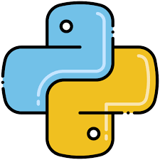

# Hi, I'm Dhanyal Tag! 👋

As a highly motivated and ambitious aspiring Cloud Engineer, I have gained extensive experience in AWS and Terraform, earning 6 AWS certifications and becoming a Terraform Associate. Additionally, I am a Certified Kubernetes Administrator (CKA) and am dedicated to continuously expanding my skill set in the cloud computing field.

At the age of 16, I am passionate about technology and am committed to pursuing a career in Cloud Engineering. With a strong foundation in programming languages such as Python and experience working with cloud technologies, I am confident in my ability to excel in this field.

I am a fast learner and thrive in challenging environments, eager to tackle complex projects and deliver innovative solutions. I am excited to connect with like-minded professionals and collaborate on projects that leverage the latest cloud technologies to drive business success.

- 💻 I’m currently learning AWS, Terraform and CICD security best practices
- 💬 Ask me about anything cloud related im glad to help
- 📫 How to reach me: tagdhanyalh@gmail.com
- 📝 Writing articles and sharing my knowledge on [Linkedin](https://www.linkedin.com/in/dhanyal-tag-a17742268/) as well as [Medium](https://medium.com/) 📚

 

Languages and Tools:
-  
-  
-  
-  
-  
-  
-  
-  
-  
-  
-  
-  
-  
-  
-  
-  
-  
-  
-  
-  

