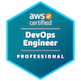
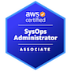

# Dhanyal Tag - Software Engineer & Aspiring Solution Architect

Hey there! 👋 I'm Dhanyal Tag, a modern Software Engineer with DevOps and AI skills. Here's a quick overview:

## Key Areas

### 🌐 Cloud Solutions
- **AWS:** 3 years of hands-on experience.

### ⚙️ DevOps & Infrastructure
- **Skills:** Docker, Kubernetes, Terraform.

### 🤖 AI Skills
- **Focus:** Generative AI solutions.

### 🚀 Fast Learner
- **Current Status:** 17 years old, aspiring to study computer science at university with a focus on AI.

## Certifications

<!-- Skills -->
## Skills

<!-- Contact Me -->
## Contact Me
- 📫 Connect with me on [LinkedIn](https://www.linkedin.com/in/dhanyaltag/)
- ✉️ Drop me an email at [dhanyal716@gmail.com](mailto:dhanyal716@gmail.com)

<!-- Resume and Website -->
## Resume & Website
- [Download my Resume (PDF)](https://your-website.com/your-resume.pdf) *(Work in Progress, will update soon)*
- [Visit my Portfolio Website](https://your-portfolio-website.com) *(Work in Progress, will update soon)*
